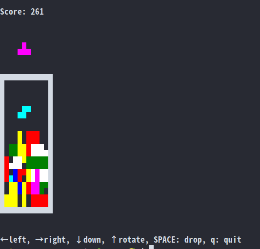

# Tetris for the Command Line



### Install with npm
```
npm install -g tetris-cli
tetris-cli
```

### Download & Install (via node)

```
git clone https://github.com/venkatperi/tetris
cd tetris
npm install
```

To run:

    npm start 


